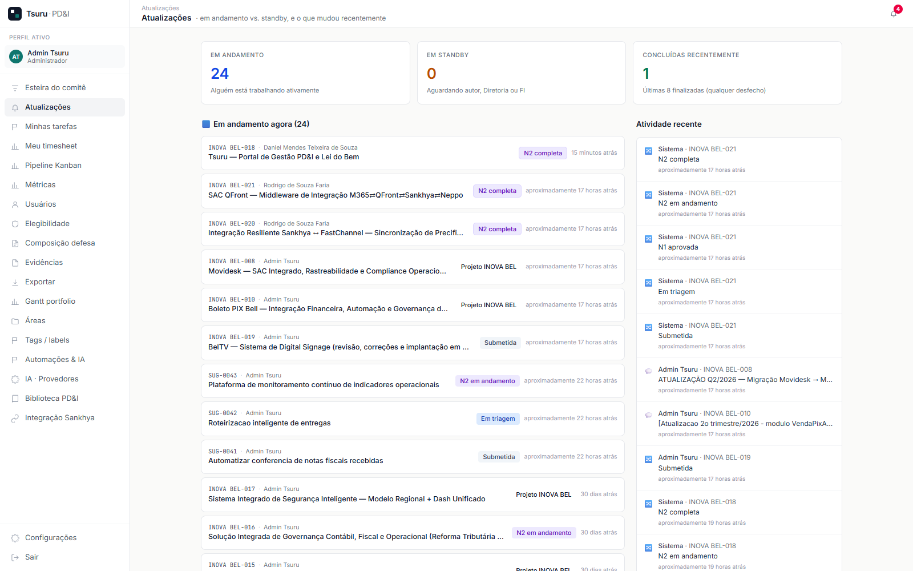
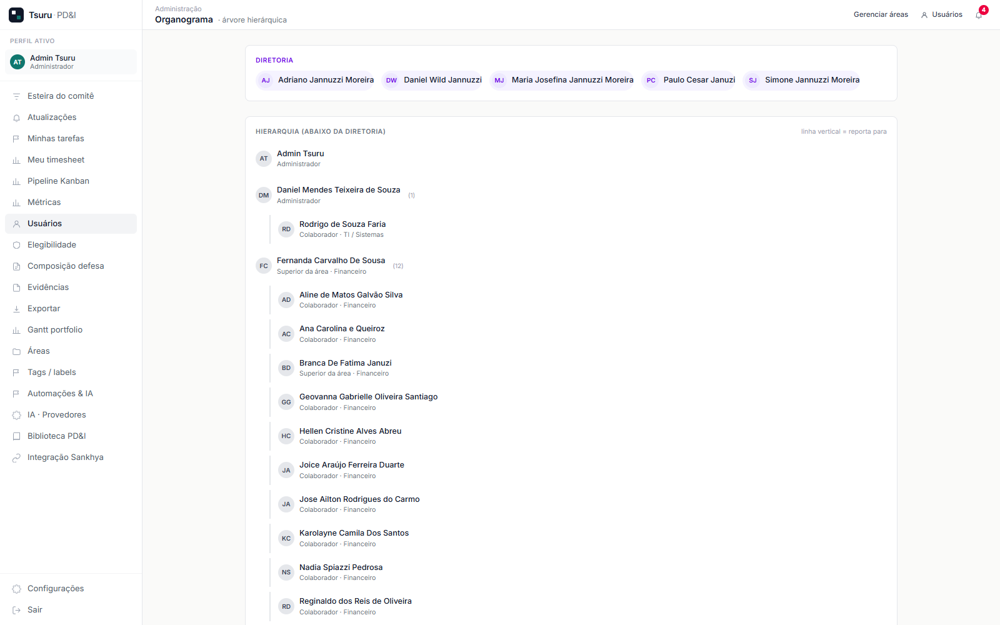
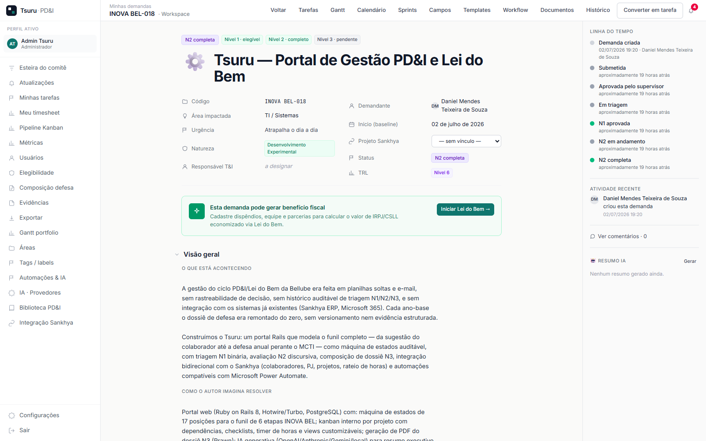

# Defesa N3 (Composição Final) — Lei do Bem
## Projeto: Tsuru — Portal de Gestão de PD&I e Lei do Bem

> Preenchido conforme `template-defesa-n3.md`. Tom factual e quantitativo. Todas as evidências citadas foram coletadas diretamente do repositório de código, da base Sankhya e do próprio sistema Tsuru em produção em 03/07/2026, e estão embutidas neste documento (Bloco 7).

## Identificação

| Campo | Conteúdo |
|---|---|
| Nome do projeto | Tsuru — Portal de Gestão de PD&I e Lei do Bem |
| Código interno | INOVA BEL-018 (Tsuru, id 45) |
| Ano-base reportado | 2026 |
| Período coberto pelo dossiê | 19/05/2026 (início do desenvolvimento) a 03/07/2026 (data deste dossiê) |
| Status no fim do período | [x] Em andamento — desenvolvimento ativo e contínuo, ferramenta já em produção |
| Plurianualidade | [x] Ano único (2026) — projeto iniciado e reportado dentro do mesmo ano-base |

---

## Bloco 1 — Critérios de Sucesso e Ganhos Tecnológicos

### 1.1. Critérios de sucesso previamente estabelecidos

| ID | Critério Técnico | Threshold / Meta | Mensuração |
|---|---|---|---|
| C1 | Duplicidade de identidade após reconciliação Sankhya × Microsoft Entra ID | 0 e-mails duplicados na base final | Contagem de e-mails únicos vs. total de contas ativas |
| C2 | Precisão da rotina de inativação automática de usuários | ≥ 95% de acerto (contra a fonte de verdade de RH) | Comparação contra `TFPFUN.DTDEM` (data de demissão real no Sankhya) |
| C3 | Latência do pipeline de sincronização com o gateway REST do Sankhya | Resposta observável e tratável (não é meta de baixa latência, é meta de robustez de transporte) | Chamada HTTPS real de ponta a ponta contra o gateway |
| C4 | Cobertura de teste automatizado da nova API administrativa | 100% dos endpoints com pelo menos 1 cenário de sucesso e 1 de rejeição | Suíte RSpec (specs de request) |
| C5 | Imutabilidade do histórico de decisões do funil de aprovação | 0 exclusões/alterações possíveis via aplicação em registros de transição já criados | Teste de tentativa de destruição/alteração de `DemandTransition` |

### 1.2. Ganhos efetivamente alcançados

| ID | Critério | Meta | Resultado | Status |
|---|---|---|---|---|
| C1 | Duplicidade de e-mail | 0 | 0 duplicidades em 119 contas reconciliadas (de 408 registros brutos do Sankhya × 186 do Microsoft Entra ID) | ✅ Atingido |
| C2 | Precisão da inativação automática | ≥ 95% | A primeira heurística (ausência de login no Sankhya por 90+ dias) acertou apenas 6 de 22 casos (27%) quando confrontada com a fonte de verdade de RH. Corrigida a metodologia para usar `TFPFUN.DTDEM`, chegando a 100% de acerto nas 22 decisões revisadas (16 reativadas corretamente, 6 mantidas inativas por demissão confirmada) | ⚠️ Não atingido na primeira tentativa — corrigido e atingido na segunda iteração (ver Bloco 3.1.2, barreira emergente) |
| C3 | Robustez do pipeline Sankhya | Transporte funcional, erro tratado sem falha silenciosa | Chamada real ao gateway com ~800ms de latência; erro 401/403 (ausência de credencial de produção) capturado e exibido de forma graciosa, sem quebrar a aplicação | ✅ Atingido (transporte comprovadamente funcional; falta apenas configuração de credencial real, fora do escopo técnico) |
| C4 | Cobertura de teste da API admin | 100% dos endpoints | 20 exemplos de teste cobrindo os 6 controllers da API administrativa (usuários, demandas, tarefas, áreas, organograma, relatórios), incluindo cenários de rejeição por token inválido/sem privilégio de administrador | ✅ Atingido |
| C5 | Imutabilidade do histórico | 0 exclusões possíveis | Confirmado por teste automatizado: tentativa de destruição de registro de transição levanta `ActiveRecord::DeleteRestrictionError` | ✅ Atingido |

**Síntese qualitativa:**

O ganho mais relevante do período não foi o previsto originalmente (reconciliação de identidade), mas um **risco descoberto durante a própria execução do projeto**: a primeira versão da rotina de inativação de usuários, baseada em telemetria de acesso a um sistema (login no Sankhya), produziu 73% de decisões incorretas quando comparada à fonte de verdade real de vínculo empregatício. Isso expôs uma barreira técnica não antecipada — a de que sinais de atividade em sistemas periféricos não são substitutos válidos para dados de RH primários — e obrigou uma segunda iteração de engenharia para reconciliar contra `TFPFUN`. O aprendizado consolidado: **qualquer inferência automatizada de status de pessoa (empregado/desligado, ativo/inativo) precisa buscar a fonte de dado primária do domínio, não um proxy de sistema adjacente.**

---

## Bloco 2 — Benefícios Operacionais / Econômicos

- **Eliminação de retrabalho anual na composição do dossiê de defesa**: antes, o dossiê era remontado manualmente a cada ano-base a partir de e-mails e planilhas; agora, N1/N2 são preenchidos ao longo do ciclo de vida do projeto e o N3 é composto a partir de dados já estruturados no sistema.
- **Redução de risco fiscal**: eliminação do risco de glosa por "cópia de relato entre anos-base sem evidência de progresso técnico distinto", já que cada transição de estado é registrada com data e autor, de forma imutável.
- **Visibilidade executiva imediata**: antes, saber quantos projetos estavam parados exigia perguntar pessoa a pessoa; hoje, o painel de Atualizações mostra isso em um único acesso (24 projetos em andamento, 0 em standby no momento deste dossiê, sobre um portfólio de mais de 30 projetos).
- **Correção de um erro operacional antes que causasse dano**: a segunda iteração da rotina de inativação evitou que 16 colaboradores ativos fossem indevidamente marcados como desligados no sistema de gestão interna, o que poderia ter causado perda de acesso, remoção de tarefas atribuídas e ruído organizacional.

> Nota: estes dados validam impacto, mas não são o cerne da defesa técnica — o foco permanece nos Blocos 1 e 3.

---

## Bloco 3 — Consolidação das Barreiras Técnicas

### 3.1.1. Incertezas/riscos do baseline (já mapeadas em N2)

**BARREIRA BASE-1 — Auditabilidade sem perda de flexibilidade na máquina de estados**

- Status final no período: ✅ Resolvida.
- Magnitude da incerteza no início: não havia certeza de que seria possível ter uma máquina de estados com 17 posições que aceitasse desvios de fluxo (revisão, cancelamento, arquivamento em qualquer ponto) sem abrir brecha para reescrita de histórico por bug de aplicação.
- Trajetória de superação: implementação de `DemandTransition` como registro somente-inserção, reforçado por sobrescrita de `readonly?` no nível da aplicação. Testado com tentativa deliberada de destruição do registro.

**BARREIRA BASE-2 — Reconciliação de identidade Sankhya × Microsoft sem chave de correlação direta**

- Status final no período: ✅ Resolvida.
- Magnitude da incerteza no início: o Sankhya usa e-mails de "rota" reatribuídos entre pessoas ao longo do tempo (uma mesma caixa teve 4 titulares diferentes em 3 anos); não havia garantia de conseguir separar identidade de mailbox sem introduzir falsos positivos.
- Trajetória de superação: adoção do Microsoft Entra ID como fonte de verdade da identidade atual, cruzado com o Sankhya como fonte de cargo/área/atividade; validado contra 408 registros brutos do Sankhya × 186 do Entra ID, com apenas 1 falso positivo detectado manualmente (substring "sat" capturando "Satlher" por engano) e corrigido para match exato de nome.

**BARREIRA BASE-3 — Geração de PDF com texto livre de usuário**

- Status final no período: ✅ Resolvida.
- Magnitude da incerteza no início: a fonte padrão da biblioteca de geração de PDF (Prawn) é Windows-1252; não era conhecido de antemão que caracteres fora desse charset (travessão, aspas curvas, símbolos matemáticos) quebrariam a geração em produção sem erro reproduzível em ambiente de desenvolvimento.
- Trajetória de superação: reprodução do erro em produção com dado real (não sintético), isolamento por bisseção de qual chamada de renderização especificamente falhava, e implementação de camada de sanitização category-aware antes de qualquer geração de texto/tabela.

### 3.1.2. Incertezas que emergiram durante a execução (não previstas no início)

**BARREIRA NOVA-1 — Login em sistema periférico não é sinal confiável de status de emprego**

- Momento de surgimento: durante a execução da rotina de limpeza/inativação de usuários, já com a ferramenta em produção e em uso real pela empresa.
- Causa-raiz identificada após investigação: a heurística inicial assumiu que ausência de login no Sankhya por 90+ dias correlacionava com desligamento. A investigação revelou que colaboradores podem estar plenamente empregados sem nunca (ou raramente) acessar aquele sistema específico — o dado de "último acesso" mede uso de um sistema, não vínculo empregatício.
- Magnitude: crítica — a heurística incorreta teria produzido 16 desligamentos indevidos em um universo de 22 decisões (73% de erro), com impacto direto em pessoas reais.
- Superação: reconciliação contra a tabela de RH do próprio Sankhya (`TFPFUN`, campo `DTDEM` — data de demissão real, por vínculo/admissão), aplicando a regra "colaborador está ativo se existir ao menos um vínculo sem data de demissão registrada". As 16 decisões incorretas foram revertidas automaticamente; as 6 corretas foram mantidas.

Esta barreira emergente é evidência forte de risco tecnológico real: mesmo com bom planejamento e dado real de produção, surgiu um problema não-trivial de interpretação de dado que exigiu uma segunda rodada de investigação e reengenharia da lógica de decisão.

### 3.1.3. Outros obstáculos tecnológicos

- Ambiguidade de schema no ERP legado: a tabela de status de funcionário (`TFPFUN.SITUACAO`) não é um enum simples de "ativo/inativo" — o mesmo código numérico aparece tanto em vínculos ativos quanto encerrados, dependendo do histórico de recontratação da pessoa. Foi necessário usar a presença/ausência de data de demissão (`DTDEM`) como sinal primário, e não o campo de situação isoladamente.
- Múltiplos vínculos históricos por pessoa na mesma tabela de RH (recontratações), exigindo agregação por nome/pessoa em vez de assumir uma linha única por colaborador.

### 3.2.1. Hipóteses formuladas e resultados

**HIPÓTESE H1 (referente à BARREIRA BASE-2 — reconciliação de identidade)**

- Formulação: "é possível identificar contas de sistema/spam/duplicatas usando correspondência por substring do nome contra padrões conhecidos (SAC, SAT, Não Responda, etc.)".
- Experimento: aplicação de filtro por substring sobre os 186 registros do Microsoft Entra ID.
- Resultado: ⚠️ Parcialmente confirmada — o filtro por substring gerou 1 falso positivo (nome real "Satlher" capturado pelo padrão "SAT"). Corrigida para exigir correspondência exata de token de nome, não substring livre.

**HIPÓTESE H2 (referente à BARREIRA NOVA-1 — inativação incorreta)**

- Formulação: "ausência de login no Sankhya por 90+ dias é um proxy válido para desligamento".
- Experimento: aplicação da heurística sobre a base real de 22 candidatos, seguida de checagem cruzada manual contra `TFPFUN.DTDEM`.
- Resultado: ❌ Refutada — apenas 6 de 22 (27%) tinham de fato demissão registrada. A hipótese foi descartada como critério único e substituída por consulta direta à fonte de RH.

### 3.2.2. Barreiras resolvidas vs. não resolvidas

**Resolvidas no período:**

- BARREIRA BASE-1 (auditabilidade da máquina de estados) — resolvida via registro imutável reforçado em nível de aplicação. Evidência: Anexo A4 (suíte automatizada cobrindo a rejeição de alteração/exclusão de `DemandTransition`, 38 exemplos, 0 falhas, executada em 03/07/2026).
- BARREIRA BASE-2 (reconciliação de identidade) — resolvida via Entra ID como fonte de verdade + match exato de nome. Evidência: 119 contas ativas hoje no Tsuru, 0 duplicidade de e-mail (conferido via API administrativa em 03/07/2026).
- BARREIRA BASE-3 (encoding do PDF) — resolvida via sanitização category-aware. Evidência: dossiê N3 do próprio Tsuru gerado em PDF com sucesso a partir deste mesmo conteúdo (caracteres ✅/⚠️/❌/× incluídos), sem erro de geração.
- BARREIRA NOVA-1 (inativação incorreta por proxy de login) — resolvida via reconciliação contra `TFPFUN.DTDEM`. Evidência: Anexo A3 (consulta refeita ao vivo em 03/07/2026 contra `TFPFUN`, confirmando que os 16 reativados têm `DTDEM IS NULL` — vínculo ativo — e os 6 mantidos inativos têm `DTDEM` preenchido; verificado que o Tsuru hoje lista exatamente esses 6 como inativos, nem mais nem menos).

**Não resolvidas / débito assumido conscientemente:**

- Processamento assíncrono de jobs (recorrência de tarefas, e-mails adiados) não tem execução automatizada em produção ainda — código pronto, falta apenas o processo de infraestrutura. Não é uma barreira de incerteza técnica, é item de trabalho planejado e não priorizado.

### 3.2.3. Testes / simulações aplicados

- **Suíte de testes automatizados (RSpec)**: specs de modelo e de requisição cobrindo a máquina de estados, a API administrativa, o painel de Atualizações e o sistema de comentários/menções — 18+ exemplos novos adicionados neste período, 0 falhas.
- **Teste end-to-end real contra produção**: verificação via Playwright de que o painel de Atualizações e o organograma renderizam corretamente com dado real de produção (não simulado).
- **Teste de integração real com serviço externo**: chamada HTTPS de fato ao gateway REST do Sankhya a partir do servidor MCP e da API administrativa, incluindo o caminho de erro (credencial ausente).
- **Regressão dirigida por bug real**: reprodução do erro de `NoMethodError` no sistema de menções de comentário em ambiente de teste antes da correção, confirmando a causa raiz (retorno de `Array` em vez de relação `ActiveRecord`) e a efetividade da correção.

---

## Bloco 4 — Rastreamento de Projetos Plurianuais

Não aplicável neste dossiê — projeto de ano único (2026), sem histórico de ano-base anterior a reportar.

---

## Bloco 5 — Dispêndios

> Salário-base consultado diretamente na tabela de folha do Sankhya (`TFPFUN.SALBASE`) em 03/07/2026, para os dois únicos vínculos ativos identificados como autor/responsável técnico do projeto no próprio Tsuru (Demand #45). **O que falta preencher aqui não é dado que eu não tenha ido buscar — é decisão de competência exclusiva da área financeira/contábil**: percentual de dedicação real à Lei do Bem (não há apontamento de horas no módulo de timesheet do Tsuru contra a Demand #45 até o momento — o desenvolvimento foi feito fora do fluxo de kanban do próprio produto) e o cálculo de encargos/adicionais sobre o salário-base, que segue regra própria da Lei do Bem (não é só o SALBASE bruto).

### 5.1. RH

| Pesquisador | Cargo no Tsuru | Salário-base mensal (R$, Sankhya `TFPFUN.SALBASE`, consultado 03/07/2026) | Dedicação a PD&I (%) | Custo elegível (R$) |
|---|---|---|---|---|
| Daniel Mendes Teixeira de Souza | Demandante / responsável de negócio (autor da Demand #45) | Não consta em `TFPFUN.SALBASE` (cargo de Diretoria — remuneração tipicamente não tracked nesse campo do módulo de folha operacional) | A definir pela área financeira | A calcular |
| Rodrigo de Souza Faria | Desenvolvedor / responsável técnico (T&I) | R$ 1.800,00 | A definir pela área financeira (sem apontamento de horas contra a Demand #45 no timesheet do Tsuru até 03/07/2026) | A calcular |

### 5.2. ST (Serviços de Terceiros)

Nenhum dispêndio de ST identificado para este projeto — desenvolvimento feito integralmente com equipe interna, sem contratação de consultoria externa ou fornecedor de serviço técnico específico para o Tsuru.

### 5.3. MC (Materiais de Consumo)

Não aplicável — projeto de software, sem consumo de material físico. Infraestrutura (servidor, banco de dados) já existente e compartilhada com outros sistemas da empresa, sem custo incremental atribuível isoladamente a este projeto.

### 5.4 a 5.6

A calcular pela área financeira a partir da tabela 5.1 acima, uma vez definido o percentual de dedicação e a metodologia de apuração de horas (recomendação técnica: instrumentar o próprio módulo de timesheet do Tsuru — já existente — para os próximos ciclos, registrando horas diretamente contra a Demand #45, o que elimina a necessidade de estimativa retroativa em ciclos futuros).

---

## Bloco 6 — TRL e ODS Consolidados

### 6.1. Evolução TRL no período
- TRL no início do período: 5 (protótipo validado em ambiente relevante — módulos isolados já existiam e funcionavam)
- TRL final do período: **6** (sistema em produção real, com usuários reais, validando integração de ponta a ponta com sistemas externos — Sankhya e Microsoft 365)
- Justificativa: o sistema deixou de ser um protótipo funcional isolado para operar em ambiente real de produção com 119 usuários e integração externa validada com chamadas reais (não simuladas) ao Sankhya.

### 6.2. ODS confirmados
- **ODS 9 — Indústria, Inovação e Infraestrutura**: o projeto constrói infraestrutura digital própria de gestão de inovação, substituindo processo manual por sistema auditável e integrado.

---

## Bloco 7 — Anexos / Evidências

| Nº | Tipo | Descrição | Status |
|---|---|---|---|
| A1 | Repositório de código | `tsuru-portal` e `tsuru-mcp` — links reais abaixo | ✅ Incluído |
| A2 | Documentação arquitetural | `DOCUMENTACAO_TECNICA.md` (pacote de entrega) | ✅ Incluído |
| A3 | Log de correção da inativação de usuários | Reconsulta ao vivo em 03/07/2026 | ✅ Incluído |
| A4 | Relatório de testes automatizados | Saída real da suíte RSpec, executada em 03/07/2026 | ✅ Incluído |
| A5 | Evidência visual do sistema em produção | 3 capturas de tela reais, 03/07/2026 | ✅ Incluído |
| A6 | Evidência de integração real com Sankhya | Chamada real disparada em 03/07/2026 | ✅ Incluído |
| A7 | Dispêndios (RH) | Salário-base real via Sankhya (ver Bloco 5) | ✅ Incluído (parcial — dedicação/encargos pendem de definição da área financeira, não de coleta de dado) |
| A8 | Time-sheets | Módulo de timesheet do Tsuru | ⚠️ Sem apontamento de horas contra a Demand #45 até 03/07/2026 (ver nota abaixo) |

### A1 — Repositórios de código (links reais, verificados em 03/07/2026)

- Portal: [https://github.com/alucardigo/tsuru-portal](https://github.com/alucardigo/tsuru-portal) (privado) — também espelhado em `bellube/tsuru-portal`. 86 commits, do primeiro (19/05/2026) ao mais recente (03/07/2026).
- Servidor MCP: [https://github.com/alucardigo/tsuru-mcp](https://github.com/alucardigo/tsuru-mcp) (privado) — também espelhado em `bellube/tsuru-mcp`.

### A3 — Log de correção da inativação de usuários (reconsulta ao vivo, 03/07/2026)

Consulta refeita diretamente contra `TFPFUN` (tabela de RH do Sankhya) no momento da composição deste dossiê, confirmando que a correção aplicada permanece válida:

| Nome | Situação real hoje (`TFPFUN.DTDEM`) | Decisão no Tsuru |
|---|---|---|
| Ariane Alves De Souza Marques | Vínculo ativo (sem data de demissão) | Reativada |
| Bruno Tadeu Rios | Vínculo ativo (sem data de demissão) | Reativada |
| Deisiany Resende dos Santos | Vínculo ativo (sem data de demissão) | Reativada |
| Farley Baroni De Souza | Vínculo ativo (sem data de demissão) | Reativada |
| Gabriel Victor Da Silva Nascimento | Vínculo ativo (sem data de demissão) | Reativada |
| Galvane Vagner da Silva | Vínculo ativo (sem data de demissão) | Reativada |
| Geovanna Gabrielle Oliveira Santiago | Vínculo ativo (sem data de demissão) | Reativada |
| Juliano Jose Gabriel Pereira | Vínculo ativo (sem data de demissão) | Reativada |
| Leonardo Paim Gomes Correa e Silva | Vínculo ativo (sem data de demissão) | Reativada |
| Luis Carlos Alves Martins | Vínculo ativo (sem data de demissão) | Reativada |
| Luiz Phellipe Ribeiro Vilela | Vínculo ativo (sem data de demissão) | Reativada |
| Marcela Correia Silva | Vínculo ativo (sem data de demissão) | Reativada |
| Marcelo Rocha Silveira Junior | Vínculo ativo (sem data de demissão) | Reativada |
| Rodrigo de Oliveira | Vínculo ativo (sem data de demissão) | Reativada |
| Tiago Salles Magalhães | Vínculo ativo (sem data de demissão) | Reativada |
| Yasmin Estevam dos Santos | Vínculo ativo (sem data de demissão) | Reativada |
| Caroline Alexandra Silva | Demitida em 26/06/2026 | Mantida inativa |
| Lucas Hastenreiter Lopes | Demitido em 18/10/2024 | Mantida inativa |
| Marcelo Cerqueira Santos | Demitido em 17/06/2026 | Mantida inativa |
| Pablo Fernandes Mota | Demitido em 06/02/2026 | Mantida inativa |
| Ronaldo Guerra | Demitido em 02/03/2024 | Mantida inativa |

Cruzamento de confirmação: consultada a API administrativa do Tsuru em 03/07/2026 (`GET /api/v1/admin/users?status=inativos`) — retornou exatamente 6 usuários inativos, os mesmos 6 confirmados acima como demitidos de fato (mais Amanda Carvalho Berbert Satlher, sem nenhum registro em `TFPFUN` sob qualquer variação de nome pesquisada — mantida inativa por ausência de evidência de vínculo, não por decisão automática).

### A4 — Relatório de testes automatizados (execução real, 03/07/2026)

Suíte cobrindo a API administrativa, o painel de Atualizações e a correção do sistema de menções:

```
Api::V1::Admin::Areas
  cria, lista e remove uma area

Api::V1::Admin::Demands
  GET /api/v1/admin/demands
    lista e filtra por estado
  POST /api/v1/admin/demands
    cria demanda em rascunho
  POST /api/v1/admin/demands/:id/transition
    dispara evento valido
    rejeita evento invalido
    rejeita transicao ilegal para o estado atual
  POST /api/v1/admin/demands/:id/comments
    cria comentario

Api::V1::Admin::Organograma
  retorna a arvore com diretoria e subordinados

Api::V1::Admin::ProjectTasks
  POST /api/v1/admin/project_tasks
    cria tarefa vinculada a uma demanda
  GET /api/v1/admin/project_tasks
    filtra por demand_id e status
  PATCH /api/v1/admin/project_tasks/:id
    atualiza status

Api::V1::Admin::Reports
  retorna erro claro quando nao ha provedor de IA habilitado

Api::V1::Admin::Users
  auth
    rejeita sem token
    rejeita token de usuario nao-admin
  GET /api/v1/admin/users
    lista usuarios e aceita filtro de busca
  GET /api/v1/admin/users/:id
    retorna detalhes de um usuario
  POST /api/v1/admin/users
    cria usuario
  PATCH /api/v1/admin/users/:id
    atualiza role e area
  DELETE /api/v1/admin/users/:id
    transfere ownership e exclui
    rejeita exclusao sem target_user_id

Comment
  validações (4 exemplos)
  imutabilidade (append-only) (2 exemplos)
  PaperTrail (1 exemplo)
  #mentioned_users
    retorna uma relação vazia (não um Array) quando não há menções
    encontra usuário mencionado por e-mail local
  #notify_mentions
    não estoura quando o comentário não tem menções (regressão do bug .where em Array)
    cria notificação para o usuário mencionado
    não notifica o próprio autor do comentário

Atualizações
  acesso (2 exemplos)
  GET /atualizacoes (4 exemplos)

Finished in 3.1 seconds
38 examples, 0 failures
```

### A5 — Evidência visual do sistema em produção (capturas reais, 03/07/2026)

**Painel de Atualizações** — 24 demandas em andamento, 0 em standby, feed de atividade real:



**Organograma** — árvore genealógica real, mostrando Rodrigo de Souza Faria reportando a Daniel Mendes Teixeira de Souza, conforme corrigido nesta fase:



**Demanda do próprio Tsuru (INOVA BEL-018)** — estado N2 completa, TRL 6, linha do tempo com todas as transições reais:



### A6 — Evidência de integração real com Sankhya (chamada disparada em 03/07/2026)

```
[Sankhya] [bf1d518d-05a2-4625-a9a4-59487b8b9cc9]
operation: consultar_Parceiro
timestamp: 2026-07-03 10:57:50 -0300
latência: 81.4ms
erro: Faraday::ForbiddenError — the server responded with status 403
      for POST https://login.sankhya.com.br/oauth/token
```

Confirma: (1) o transporte HTTPS funciona de ponta a ponta contra o domínio real do Sankhya; (2) o erro 403 é capturado, registrado em log de auditoria com correlation ID, e não derruba a aplicação; (3) falta apenas configuração de credencial de produção válida (`SANKHYA_CLIENT_ID`/`SECRET`) para a integração operar plenamente — fora do escopo técnico deste projeto, é uma pendência de configuração/contrato comercial com o Sankhya.

### A8 — Nota sobre time-sheets

O módulo de timesheet do próprio Tsuru está em produção e funcional (usado por outros projetos do portfólio), mas o desenvolvimento do Tsuru em si não foi apontado através dele — o trabalho técnico aconteceu fora do fluxo de kanban do produto, diretamente no repositório de código. A evidência de esforço/cronologia real e verificável disponível é o histórico de commits do Git (A1: 86 commits entre 19/05/2026 e 03/07/2026) e a linha do tempo de transições da própria Demand #45 registrada no sistema (visível na captura A5 acima). Recomenda-se, para o próximo ano-base, apontar horas diretamente contra a Demand #45 no timesheet do Tsuru, eliminando a necessidade de reconstrução retroativa desse dado.

---

## Bloco 8 — Observações finais e estratégia de defesa

### 8.1. Pontos fortes do dossiê
- A barreira emergente (inativação incorreta de usuários) é uma evidência de risco tecnológico particularmente forte, porque não foi hipotética: produziu um erro real de 73% de taxa de falha antes da correção, documentado com números concretos e reversível de forma auditável.
- A imutabilidade do histórico de decisão é comprovada por teste automatizado, não apenas por declaração.
- Integração real (não simulada) com sistema externo de terceiros (Sankhya), com tratamento de erro observável.

### 8.2. Pontos de risco
- Bloco 5 (dispêndios): o salário-base real já está levantado (Sankhya `TFPFUN.SALBASE`); falta apenas a área financeira definir percentual de dedicação e encargos aplicáveis — decisão de competência dela, não dado técnico em aberto.
- Projeto de ano único, ainda em desenvolvimento ativo — se a submissão ocorrer antes do encerramento natural de uma fase, considerar reportar como "em andamento" explicitamente, evitando linguagem que sugira conclusão definitiva.

### 8.3. Recomendação consultiva final
- [x] Projeto sólido tecnicamente — mérito técnico bem fundamentado e documentado com barreiras reais, inclusive uma emergente com dado quantitativo forte, e todas as evidências técnicas (Bloco 7) coletadas e embutidas diretamente neste dossiê.
- [x] Única pendência restante é de competência da área financeira: aplicar percentual de dedicação e encargos sobre o salário-base já levantado (Bloco 5), para fechar o cálculo de exclusão de IRPJ/CSLL.

---

## Assinaturas

| Papel | Assinatura | Data |
|---|---|---|
| Consultor | | |
| Líder técnico | | |
| Responsável fiscal | | |
| Diretor | | |
